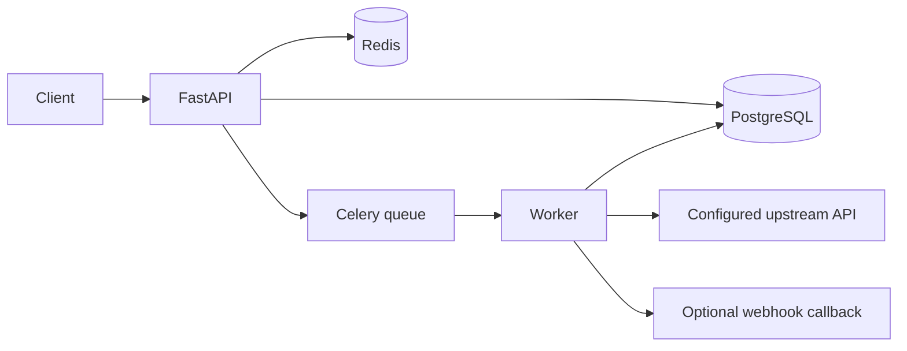

# AI Integration Service

[Русская версия](README_RU.md)

A production-style integration backend built with **Python, FastAPI, PostgreSQL, Redis and Celery**. It accepts jobs through an authenticated API, enforces idempotency, queues work, retries transient failures with exponential backoff and exposes job status for polling or callback-based integration.

## Architecture



## Features

- authenticated REST API;
- `Idempotency-Key` support to prevent duplicate work;
- PostgreSQL job state;
- Redis broker/result backend and API rate-limit counter;
- Celery worker queue;
- bounded exponential retry policy;
- configurable upstream integration;
- optional callback delivery;
- demo upstream endpoint so the stack works locally without an external service;
- Docker Compose, tests, Ruff and GitHub Actions.

## Quick start

```bash
cp .env.example .env
docker compose up --build
```

Swagger: `http://localhost:8002/docs`

### Create a job

```bash
curl -X POST http://localhost:8002/v1/jobs \
  -H 'content-type: application/json' \
  -H 'x-api-key: change-me' \
  -H 'Idempotency-Key: demo-job-0001' \
  -d '{"payload":{"customer_id":42,"task":"enrich"}}'
```

Submitting the same idempotency key returns the same job instead of creating a duplicate.

## Why this matters for an AI/automation portfolio

The service shows the point where workflow automation becomes backend engineering: durable state, queues, retries, idempotency, API contracts, worker processes and failure handling. An AI model or third-party API can be placed behind `UPSTREAM_API_URL` without changing the orchestration pattern.

## Production notes

For an internet-facing deployment add Alembic migrations, distributed tracing, a callback domain allowlist, secrets management, TLS termination and stronger tenant-aware rate limiting.

## License

MIT
